# Step 1 — SQL Server Database Design (Complete)

**Project:** Enterprise Canteen Management System  
**Database:** `CanteenManagementDB`  
**Engine:** Microsoft SQL Server 2019+  
**Django driver:** `mssql-django` / ODBC Driver 17  

> **Status:** Step 1 complete. Review and confirm before proceeding to **Step 2** (Django project structure).

## Project diagrams (images)

| Diagram | Image | Source |
|---------|-------|--------|
| **Database ERD** | [docs/diagrams/images/erd_diagram.png](docs/diagrams/images/erd_diagram.png) | [docs/diagrams/erd.mmd](docs/diagrams/erd.mmd) |
| **Overall functional flow** | [docs/diagrams/images/overall_functional_flow.png](docs/diagrams/images/overall_functional_flow.png) | [docs/diagrams/overall_functional_flow.mmd](docs/diagrams/overall_functional_flow.mmd) |

Open [docs/diagrams/view_diagrams.html](docs/diagrams/view_diagrams.html) in a browser for interactive Mermaid versions.

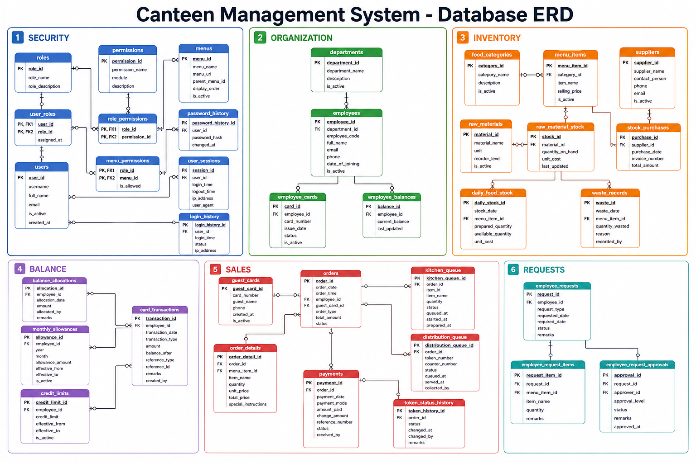

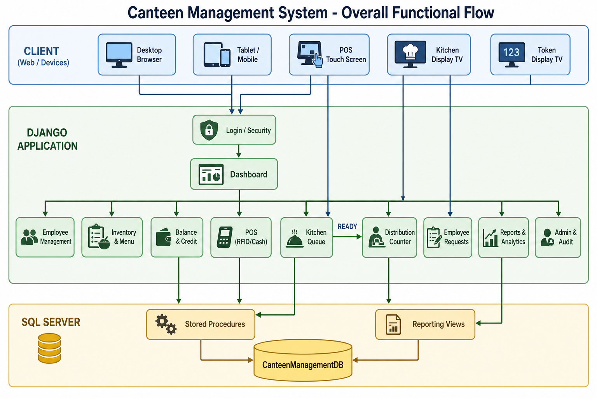

---

## Execution order (run in SSMS or sqlcmd)

| # | Script | Purpose |
|---|--------|---------|
| 1 | `database/01_create_database.sql` | Create DB, compatibility, Query Store |
| 2 | `database/02_security_users_tables.sql` | Roles, permissions, menus, users, sessions |
| 3 | `database/03_employee_tables.sql` | Departments, employees, cards |
| 4 | `database/04_food_inventory_tables.sql` | Menu, stock, purchases, waste |
| 5 | `database/05_balance_credit_tables.sql` | Balances, allocations, credit |
| 6 | `database/06_sales_pos_tables.sql` | Orders, payments, queues |
| 7 | `database/06b_employee_request_tables.sql` | Employee purchase requests |
| 8 | `database/07_system_monitoring_tables.sql` | Notifications, settings, audit |
| 9 | `database/08_indexes.sql` | Performance indexes |
| 10 | `database/09_seed_data.sql` | Master/seed data (10+ rows per module) |
| 11 | `database/10_stored_procedures_part1.sql` | Auth, password, balance |
| 12 | `database/10_stored_procedures_part2.sql` | Employee POS sale |
| 13 | `database/10_stored_procedures_part3.sql` | Card validation, kitchen, distribution, cash, alerts |
| 14 | `database/11_views.sql` | Core reporting views |
| 15 | `database/11_views_part2.sql` | Extended reporting views |
| 16 | `database/12_sample_transactions.sql` | Test transactions |

Master runner: `database/00_RUN_ALL.sql` (requires SQLCMD `:r` mode).

---

## Design principles

- **Normalized** 3NF schema, `dbo` schema for Django compatibility  
- **Soft delete:** `is_deleted` + `is_active` on all major tables  
- **Audit columns:** `created_by`, `created_at`, `updated_by`, `updated_at`  
- **PK:** `INT IDENTITY(1,1)` as `id` on every table  
- **Money:** `DECIMAL(18,2)`; quantities `DECIMAL(18,3)` where needed  
- **Unicode:** `NVARCHAR` for all text  
- **Transactions:** `SET XACT_ABORT ON` + `TRY/CATCH` in all SPs  
- **Sequences:** `seq_order`, `seq_transaction`, `seq_payment`, `seq_purchase`  

---

## Table inventory (39 tables)

### Security & users (10)
`roles`, `permissions`, `menus`, `menu_permissions`, `role_permissions`, `users`, `user_roles`, `password_history`, `user_sessions`, `login_history`

### Employees (3)
`departments`, `employees`, `employee_cards`

### Food & inventory (9)
`food_categories`, `menu_items`, `suppliers`, `raw_materials`, `raw_material_stock`, `stock_purchases`, `stock_purchase_details`, `daily_food_stock`, `food_preparation`, `waste_records`

### Balance & credit (5)
`employee_balances`, `balance_allocations`, `monthly_allowances`, `credit_limits`, `card_transactions`

### Sales & POS (7)
`guest_cards`, `orders`, `order_details`, `payments`, `kitchen_queue`, `distribution_queue`, `token_status_history`

### Employee requests (3)
`employee_requests`, `employee_request_items`, `employee_request_approvals`

### System (4)
`notifications`, `system_settings`, `audit_logs`, `activity_logs`

---

## ERD (Mermaid)

```mermaid
erDiagram
    %% ========== SECURITY ==========
    ROLES ||--o{ USER_ROLES : assigns
    USERS ||--o{ USER_ROLES : has
    ROLES ||--o{ ROLE_PERMISSIONS : grants
    PERMISSIONS ||--o{ ROLE_PERMISSIONS : includes
    MENUS ||--o{ MENU_PERMISSIONS : requires
    PERMISSIONS ||--o{ MENU_PERMISSIONS : linked
    USERS ||--o{ PASSWORD_HISTORY : tracks
    USERS ||--o{ USER_SESSIONS : opens
    USERS ||--o{ LOGIN_HISTORY : logs

    %% ========== ORGANIZATION ==========
    DEPARTMENTS ||--o{ EMPLOYEES : contains
    EMPLOYEES ||--o| EMPLOYEE_BALANCES : owns
    EMPLOYEES ||--o{ EMPLOYEE_CARDS : holds
    EMPLOYEES ||--o| USERS : links
    EMPLOYEES ||--o{ BALANCE_ALLOCATIONS : receives
    EMPLOYEES ||--o{ CREDIT_LIMITS : has
    EMPLOYEES ||--o{ CARD_TRANSACTIONS : generates
    EMPLOYEES ||--o{ EMPLOYEE_REQUESTS : submits

    %% ========== INVENTORY ==========
    FOOD_CATEGORIES ||--o{ MENU_ITEMS : groups
    SUPPLIERS ||--o{ RAW_MATERIALS : supplies
    RAW_MATERIALS ||--o| RAW_MATERIAL_STOCK : tracks
    SUPPLIERS ||--o{ STOCK_PURCHASES : fulfills
    STOCK_PURCHASES ||--o{ STOCK_PURCHASE_DETAILS : contains
    RAW_MATERIALS ||--o{ STOCK_PURCHASE_DETAILS : purchased
    MENU_ITEMS ||--o{ DAILY_FOOD_STOCK : prepared
    DAILY_FOOD_STOCK ||--o{ FOOD_PREPARATION : consumes
    RAW_MATERIALS ||--o{ FOOD_PREPARATION : used_in
    MENU_ITEMS ||--o{ WASTE_RECORDS : wasted
    RAW_MATERIALS ||--o{ WASTE_RECORDS : wasted

    %% ========== SALES ==========
    EMPLOYEE_CARDS ||--o{ ORDERS : pays
    GUEST_CARDS ||--o{ ORDERS : pays
    ORDERS ||--o{ ORDER_DETAILS : contains
    MENU_ITEMS ||--o{ ORDER_DETAILS : item
    DAILY_FOOD_STOCK ||--o{ ORDER_DETAILS : stock_ref
    ORDERS ||--o| PAYMENTS : settled
    ORDERS ||--o| KITCHEN_QUEUE : queued
    ORDERS ||--o| DISTRIBUTION_QUEUE : distributed
    ORDERS ||--o{ TOKEN_STATUS_HISTORY : history
    EMPLOYEE_REQUESTS ||--o{ EMPLOYEE_REQUEST_ITEMS : lines
    MENU_ITEMS ||--o{ EMPLOYEE_REQUEST_ITEMS : item
    EMPLOYEE_REQUESTS ||--o{ EMPLOYEE_REQUEST_APPROVALS : approvals
    USERS ||--o{ EMPLOYEE_REQUEST_APPROVALS : approves
```

---

## Business flow charts

### Main canteen flow (login → sale → kitchen → distribution)

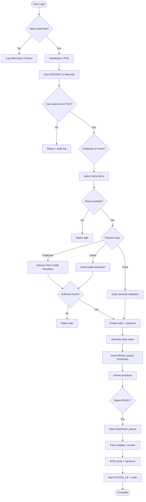

### Employee card sale

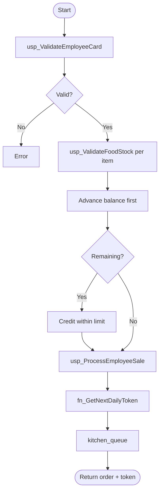

### Guest card sale

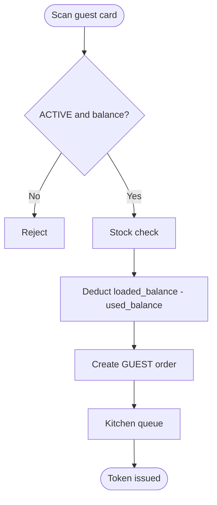

### Cash billing

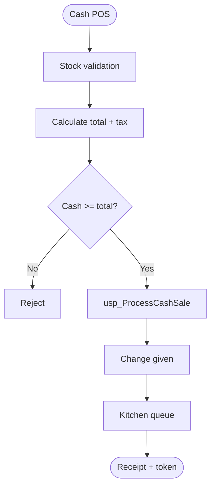

### Kitchen workflow

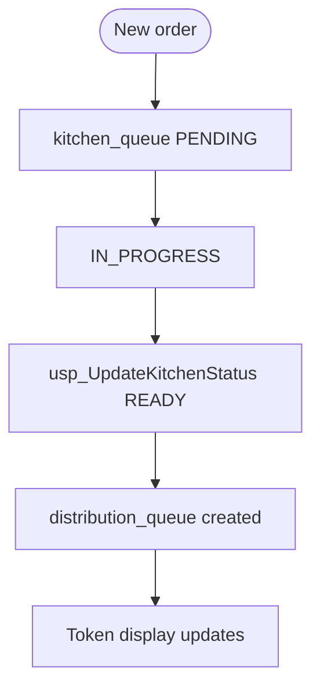

### Distribution workflow

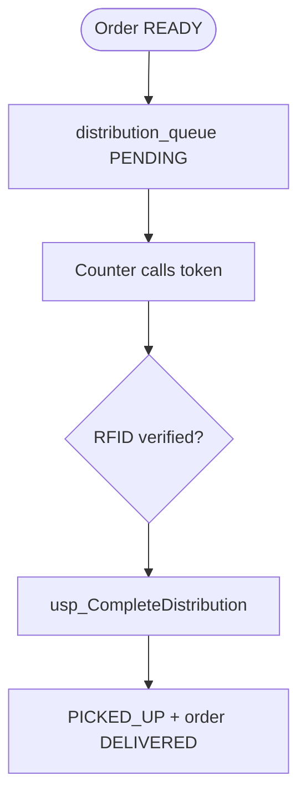

### Monthly balance allocation

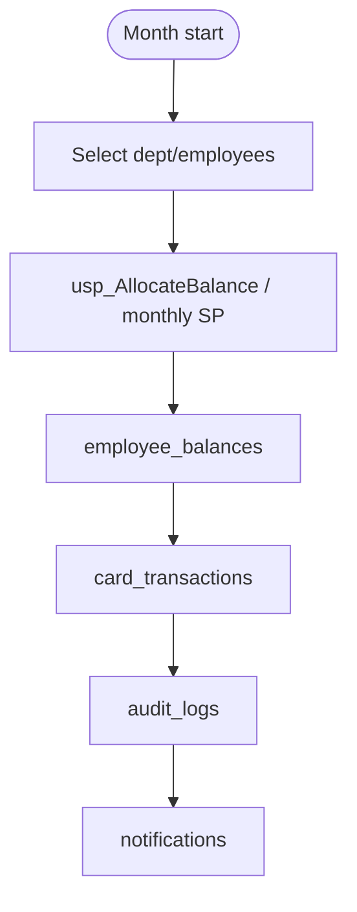

### Credit approval flow

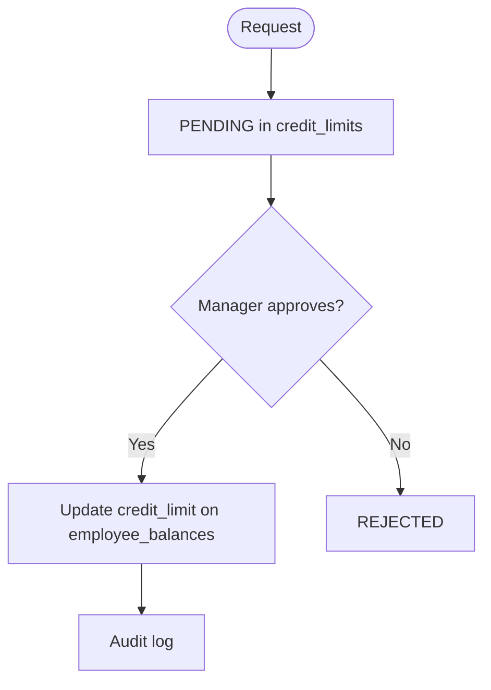

### Employee request flow

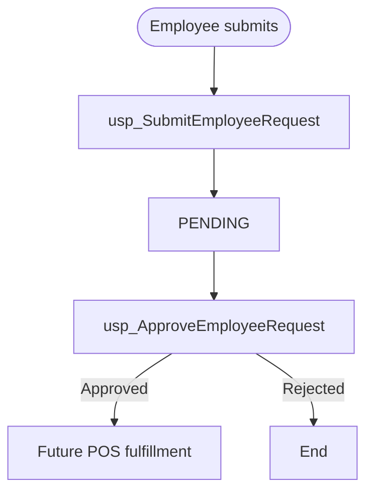

### User creation / password / role flows

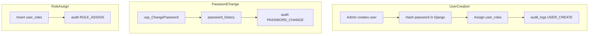

### Stock purchase / preparation / waste

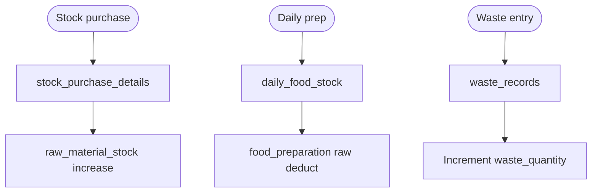

---

## Stored procedures

| Procedure | Purpose |
|-----------|---------|
| `usp_ValidateUserLogin` | Pre-auth user lookup + lockout check |
| `usp_RecordLoginSuccess` | Reset failures, session, login_history |
| `usp_RecordLoginFailure` | Increment failures, optional lock |
| `usp_ChangePassword` | Password history + audit |
| `usp_AllocateBalance` | Advance top-up / allowance |
| `usp_ProcessEmployeeSale` | Employee POS (balance + order + kitchen) |
| `usp_ValidateEmployeeCard` | Card + balance snapshot |
| `usp_ValidateFoodStock` | Daily stock check (no negative) |
| `usp_ProcessCashSale` | Cash order + stock decrement |
| `usp_UpdateKitchenStatus` | KDS status; creates distribution on READY |
| `usp_CompleteDistribution` | Pickup + token history |
| `usp_SubmitEmployeeRequest` | Web request submission |
| `usp_ApproveEmployeeRequest` | Approve/reject workflow |
| `usp_InsertAuditLog` | Central audit writer |
| `usp_RunInventoryAlerts` | Low stock + expiry notifications |
| `fn_GetNextDailyToken` | Daily-reset token numbers |

---

## Reporting views

**Part 1:** `vw_DailySalesSummary`, `vw_EmployeeBalanceStatus`, `vw_LowStockAlerts`, `vw_KitchenPendingOrders`, `vw_TopSellingItems`  

**Part 2:** `vw_MonthlySalesSummary`, `vw_CreditUsage`, `vw_ExpiryAlerts`, `vw_DistributionPendingOrders`, `vw_EmployeeTransactionHistory`, `vw_WasteSummary`, `vw_DepartmentWiseSales`, `vw_UserActivityLogs`, `vw_EmployeeRequestStatus`

---

## Business rules implemented

| Rule | Implementation |
|------|----------------|
| Balance: Advance → Credit → Reject | `usp_ProcessEmployeeSale`, `usp_AllocateBalance` |
| No negative food stock | `remaining_quantity` computed column + `usp_ValidateFoodStock` |
| Daily unique token | `UQ_orders_token_date`, `fn_GetNextDailyToken` |
| One active card per employee | `usp_ValidateEmployeeCard` check |
| Distribution after kitchen READY | `usp_UpdateKitchenStatus` (not at sale time) |
| Low stock alert threshold | `system_settings.LOW_STOCK_THRESHOLD` (default 5) |
| Expiry alert within 3 days | `system_settings.EXPIRY_ALERT_DAYS` + `usp_RunInventoryAlerts` |
| Audit on security/sales | `audit_logs`, `activity_logs`, SP hooks |

---

## Django ORM compatibility

1. Set `managed = False` on all models; use `db_table` matching SQL names.  
2. Map `BIT` → `BooleanField`, `DATETIME2` → `DateTimeField`, `DECIMAL(18,2)` → `DecimalField(max_digits=18, decimal_places=2)`.  
3. Custom user: `AUTH_USER_MODEL = 'users.User'`, `password` column → `db_column='password_hash'`.  
4. Use `select_related` / `prefetch_related` on FK-heavy POS and report queries.  
5. Call SPs via `cursor.execute("EXEC usp_...")` or `django-mssql` raw SQL in service layer.  
6. Override default manager to filter `is_deleted=False`.  
7. Use Django session auth; SPs for login audit and lockout only.  

---

## Performance recommendations

1. Run `08_indexes.sql` — covers users, cards, orders by date, queue status.  
2. Keep `READ_COMMITTED_SNAPSHOT ON` for POS concurrency.  
3. Use Query Store (enabled in `01`) to tune hot SPs.  
4. Archive old `audit_logs` / `login_history` yearly.  
5. Partition large tables (`orders`, `card_transactions`) by `order_date` when volume exceeds ~5M rows.  
6. Connection pooling in production (ODBC + Django `CONN_MAX_AGE`).  
7. Schedule `usp_RunInventoryAlerts` via SQL Agent every morning.  

---

## Next step

**Please confirm Step 1** (schema, scripts, ERD, flows) before we proceed to:

**Step 2:** Django project structure + SQL Server connection + modular apps layout.
