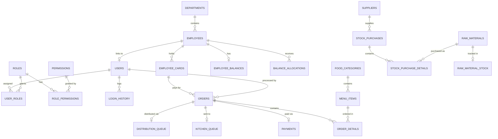
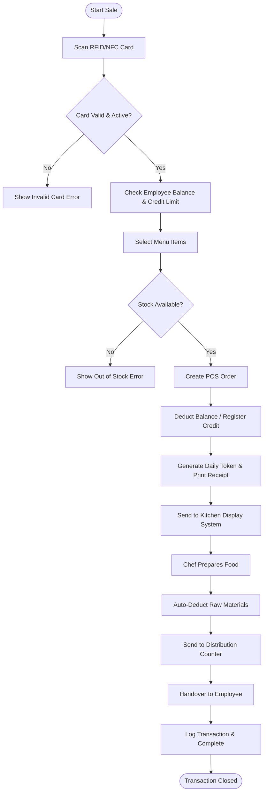
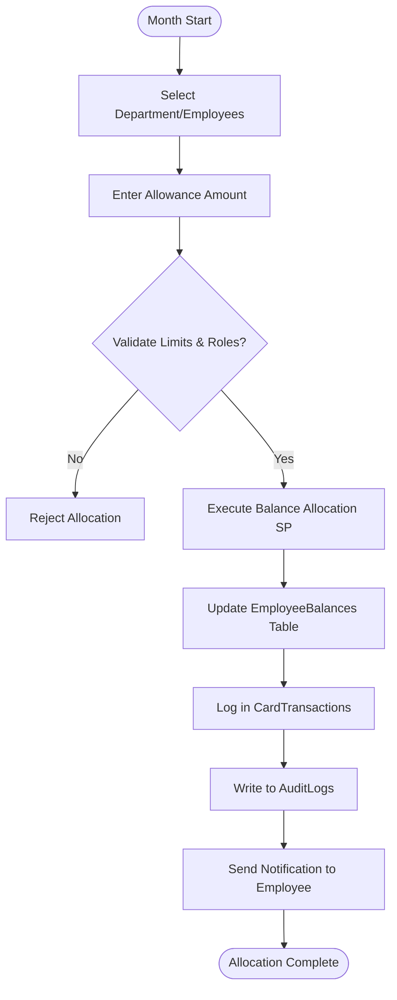
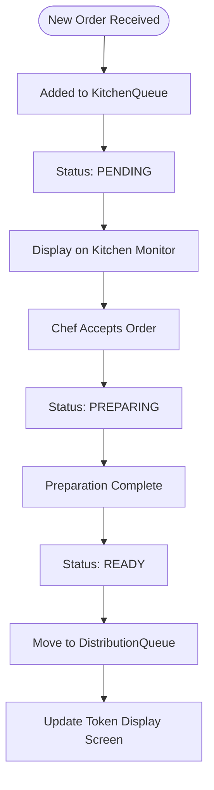

# Canteen Management System — Step 1: Database Design & Architecture

> [!NOTE]
> All requested SQL scripts (Database Creation, Tables, Constraints, Indexes, Seed Data, Stored Procedures, and Views) have already been securely generated and saved into the `database\` directory of your project workspace. This document provides the high-level architectural overview, ERD, Business Flows, and Django compatibility notes for your review before we proceed.

## 1. Entity Relationship Diagram (ERD)

The database is normalized and designed with strict adherence to SQL Server best practices, including proper Foreign Key constraints and schema grouping.

---

## 2. Business Flow Charts

### Main Canteen Flow (POS to Distribution)

### Monthly Balance Allocation Flow

### Kitchen Workflow

---

## 3. Django ORM Compatibility Notes

To ensure seamless integration with `mssql-django`, the database schema follows these rules:
1. **Primary Keys**: All tables use an `id` column defined as `INT IDENTITY(1,1)`, which maps perfectly to Django's default AutoField.
2. **Naming Conventions**: Table names use lowercase with underscores (e.g., `employee_cards`), which aligns with Django's `db_table` meta options.
3. **Data Types**:
   - `BIT` is used for booleans (`is_active`, `is_deleted`) to map to `models.BooleanField()`.
   - `DATETIME2(7)` is used for timestamps to map accurately to `models.DateTimeField()`.
   - `DECIMAL(18,2)` is used for financial fields to map to `models.DecimalField()`.
   - `NVARCHAR` is used for all text to fully support Django's Unicode expectations for `CharField` and `TextField`.
4. **Soft Deletes**: The `is_deleted` column on major tables allows overriding the Django `Manager` to filter out deleted records without losing historical data.
5. **Auditing**: `created_by`, `created_at`, `updated_by`, and `updated_at` are pre-defined, ready to be handled via a custom Django model mixin.

---

## 4. Performance Recommendations

1. **Indexing**: Non-clustered indexes are applied on all Foreign Keys (e.g., `user_id`, `employee_id`) and highly queried columns like `card_number` and `order_date`.
2. **Query Store**: Query Store has been enabled in the `01_create_database.sql` script to help analyze query performance natively within SQL Server.
3. **Transaction Safety**: All Stored Procedures (e.g., `sp_ProcessPOSOrder`) utilize `BEGIN TRY ... BEGIN CATCH` blocks and `SET XACT_ABORT ON` to ensure rollback on failure, avoiding partial data commits.
4. **Connection Pooling**: When configuring `DATABASES` in Django, ensure connection pooling is handled properly in production via ODBC settings to avoid exhaustion under heavy POS load.
